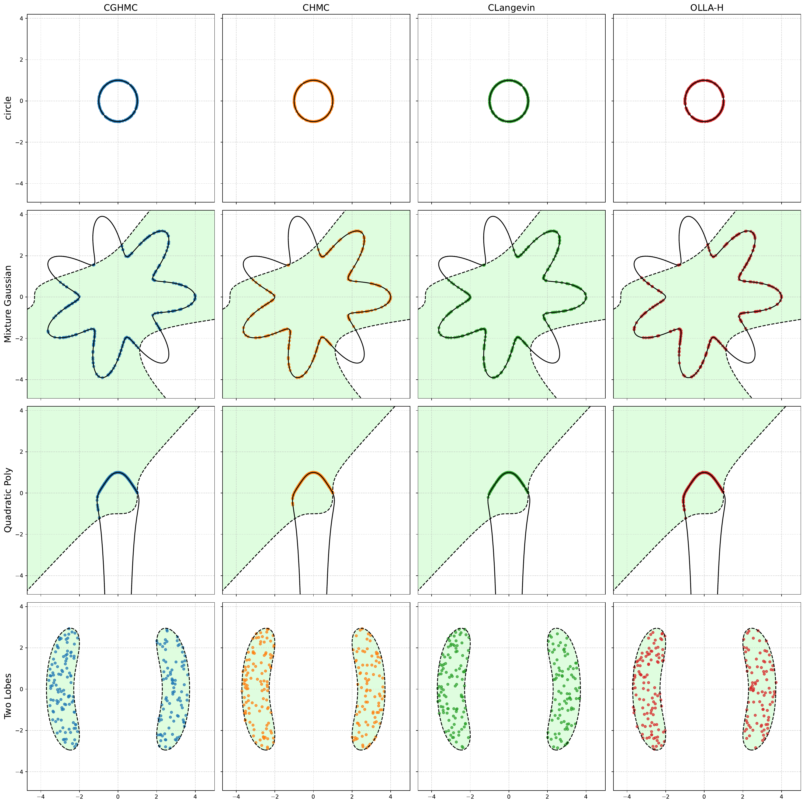

# Fast Non-Log-Concave Sampling under Nonconvex Equality and Inequality Constraints with Landing

Official PyTorch implementation of **"Fast Non-Log-Concave Sampling under Nonconvex Equality and Inequality Constraints with Landing"** (NeurIPS 2025).
 
<p align="center">
  
</p>


## Contents
- End-to-end implementations of OLLA and its Hutchinson-trace variant alongside constrained Langevin, HMC, and generalized HMC baselines.
- Ready-to-run constrained experiments ranging from low-dimensional toy geometries to high-dimensional polymers and fairness-aware Bayesian neural networks.


## Repository Layout
- `src/samplers/`: Core sampling algorithms (`OLLA`, `OLLA_H`, `CLangevin`, `CHMC`, `CGHMC`) built on a shared `BaseSampler`.
- `src/constraints/`: Constraint modules exposing `potential_fn`, `h_fns`, `g_fns`, default hyperparameters, and `generate_samples`.
- `experiments/run_analysis.py`: main experiment runner for benchmarking samplers on any combination of constraints.

## Installation

Create the Conda environment defined in `environment.yml`.

```bash
conda env create -f environment.yml
conda activate olla
```

The environment installs the package in editable mode. If you need a GPU build, install the appropriate CUDA toolkit (for example, `pip3 install torch torchvision --index-url https://download.pytorch.org/whl/cu130`) after activating the environment (However, CPU mode is preferred across all experiments unless running parallel sampling for multichain). The German Credit experiment downloads data from OpenML on first use, so ensure outbound network access is available when running `german_credit`.

## Quick Start
To use the experiment runner:

```bash
python experiments/run_analysis.py
```

or one can specify the arguments, for example, via:

```bash
python experiments/run_analysis.py \
  --experiments circle two_lobe highdim_polymer \
  --samplers OLLA-H CLangevin CGHMC \
  --device cpu
```

Key flags:
- `--experiments`: names of modules in `src/constraints` (e.g., `circle`, `quadratic_poly`, `german_credit`, `highdim_stress`, `highdim_polymer`).
- `--samplers`: subset of `{OLLA, OLLA-H, CLangevin, CHMC, CGHMC}`.
- `--natoms`, `--n_dim`, `--NN_dim`: override defaults for polymer, synthetic stress, and German Credit setups respectively.

The script saves CSV summaries, optional PDF plots (2D experiments), and prints diagnostics such as ESS, constraint violations, and task-specific metrics.

## Constraint Library
- **`circle`**: Samples from a 2D Gaussian restricted to the unit circle (`x1^2 + x2^2 = 1`). Provides analytic initialization on the manifold.
- **`quadratic_poly`**: Polynomial equality (`x1^4 x2^2 + x1^2 + x2 = 1`) plus inequality (`x1^3 - x2^3 <= 1`) with rejection-based initialization.
- **`mix_gaussian`**: Mixture of nine isotropic Gaussians restricted to a seven-lobed star contour with an additional polynomial inequality.
- **`two_lobe`**: Double-moon density defined through an inequality, highlighting curved boundaries without equalities.
- **`highdim_stress`**: Randomly generated high-dimensional linear and spherical equalities with spherical obstacle inequalities; designed for testing the performance of samplers under high-dimension, high numbers of equality / inequality constraints.
- **`highdim_polymer`**: Configurable polymer chain in 3D with bond-length and bond-angle constraints, steric inequalities, and torsion/WCA potentials.
- **`german_credit`**: Fairness-aware 2-layer Bayesian neural network with equality constraints on TPR/FPR parity and monotonicity inequalities on selected features.

Each module exposes `EXPERIMENT_SETTINGS` (steps, particle counts) and `SAMPLER_SETTINGS` (per-sampler hyperparameters) used by `run_analysis.py`.

## Sampler Implementations
- **OLLA** (`src/samplers/olla.py`): Original algorithm with analytic trace correction. Suitable for low-to-moderate dimensions.
- **OLLA-H** (`src/samplers/olla_h.py`): Hutchinson-trace variant that estimates mean-curvature term; preferred for high-dimensional problems or many constraints (when the number of Hutchinson probe `N` = 0, it can accelerate much faster with slight drop of sampling accuracy).
- **CLangevin** (`src/samplers/clangevin.py`): Constrained Langevin with slack-variable augmentation and SHAKE-style projections for inequality handling.
- **CHMC** (`src/samplers/chmc.py`): Constrained Hamiltonian Monte Carlo using a RATTLE integrator on the augmented state with slack-variables.
- **CGHMC** (`src/samplers/cghmc.py`): Constrained generalized HMC with MH correction; inequality constraints enforced via rejection during the MH step.

All samplers inherit from `BaseSampler`, which standardizes RNG handling, step-size configuration, and return conventions (`trajectory`, `h_vals`, `g_vals`).

## Citing

If you use this codebase or benchmark experiments, please cite:

```bibtex
@inproceedings{jeon2025olla,
  title     = {Fast Non-Log-Concave Sampling under Nonconvex Equality and Inequality Constraints with Landing},
  author    = {Jeon, Kijung and Muehlebach, Michael and Tao, Molei},
  booktitle = {Advances in Neural Information Processing Systems},
  year      = {2025},
}
```